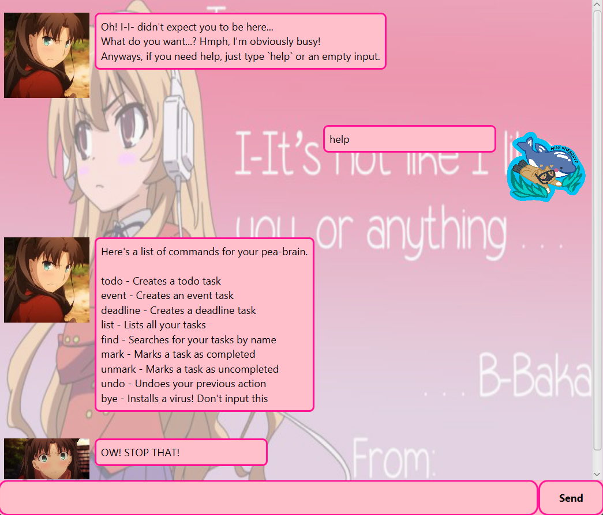

# tsundere.Tsundere User Guide




Need a motivator to finish your tasks on time? 
Tsundere is just the right task management application for you!
Just don't let anyone find out about it...

## Adding deadlines
Tsundere supports tracking deadline tasks, enabling you to easily monitor and complete
tasks on time.

Insert deadline tasks using the format `deadline <name of task> /by <end data>`

Example: `deadline TASK /by 2025-02-02T23:59`

Output:
```
New task added!
[D][] TASK (By 02-Feb-25 23:59)
```

## Feature ABC

// Feature details


## Feature XYZ

// Feature details