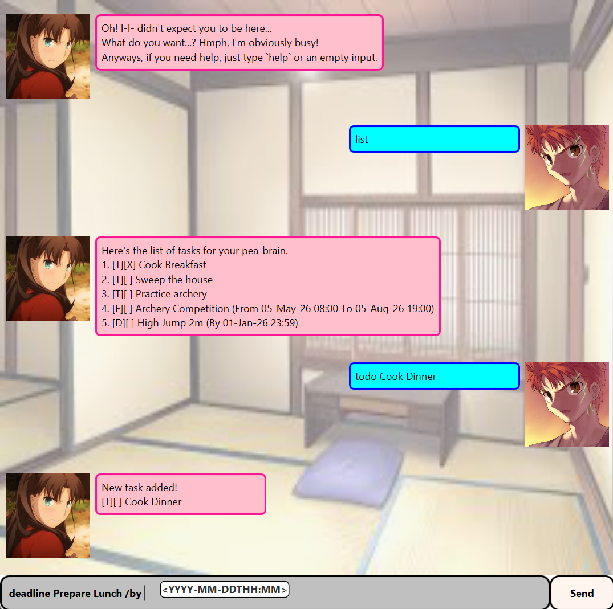

# tsundere.Tsundere User Guide




Need a motivator to finish your tasks on time? 
Tsundere is just the right task management application for you!
Just don't let anyone find out about it...

## Auto-completion
Get real-time autocompletion for command parameters, which will help you type way faster!

## Adding todos
The most basic form of tasks, with only a task name.
Can be marked as completed or not completed yet.

Insert todo tasks using the format `todo <name of task>`

Example: `todo TASK`

Output: 
```
New task added!
[T][ ] TASK
```

## Adding deadlines
Tsundere supports tracking deadline tasks, enabling you to easily monitor and complete
tasks on time.

Insert deadline tasks using the format `deadline <name of task> /by <end data>`

Example: `deadline TASK /by 2025-02-02T23:59`

Output:
```
New task added!
[D][ ] TASK (By 02-Feb-25 23:59)
```

## Adding events
Tsundere supports tracking event tasks, with a specified start and end date.

Insert event tasks using the format `event <name of task> /from <start date> /to <end date>`

Example: `event TASK /from 2025-02-02T23:59 /to 2025-02-03T23:59`

Output:
```
New task added!
[E][ ] TASK (From 02-Feb-25 23:59 To 03-Feb-25 23:59)
```

## Listing tasks
Tasks are stored automatically on a text storage file within the src folder.

View a list of all your tasks using the command `list`

Example output:
```
1. [T][ ] Task 1
2. [T][X] Task 2
3. [D][ ] Deadline Task (By 25-May-25 23:59)
4. [E][X] Event Task (From 25-May-25 23:59 To 26-May-25 23:59)
```
The index of the task is used as a reference by the other commands.

## Mark / Unmark tasks
Easily mark and unmark task completion status.
Supply the index of the task in the task list as argument.

Example: `mark 1` or `unmark 1`

Output:
```
Here, it's marked.
[D][X] Task
```

## Finding tasks
Tsundere allows you to search tasks by name, returning all tasks that contain the keyword.

Search using the format: `find <keyword>`

Example: `find TASK`

Example output:
```
Here's the list of tasks for your pea-brain.
1. [T][ ] TASK 1
2. [D][ ] TASK 2 (By 02-Feb-25 23:59)
```

## Undoing the last command

Made a mistake? You can undo the most recent task-related command.

Use the command: `undo`

Example:

```
You're so clumsy! I'll fix your mess, here.
I've undid the following command:
Add Task Command: [T][ ] TASK
```

Note: Only the commands in the current session can be undone.

## Exiting the program

Use `bye` to exit the program safely.


Bye. Hope to see you again soon!